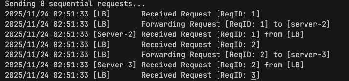
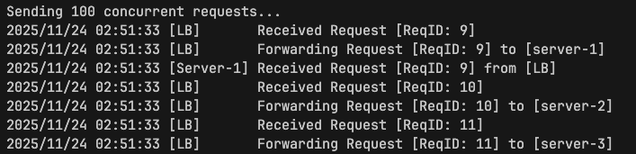

<h1>
  
  go-lb
</h1>

go-lb is a simple, custom [load balancer](https://www.cloudflare.com/en-in/learning/performance/what-is-load-balancing/) written in Go. It uses a [round-robin](https://en.wikipedia.org/wiki/Round-robin_scheduling) load balancing strategy to send requests into a set of servers with support for concurrent request handling. It also performs active and passive health checks of servers.

## Table of Contents

- [Features](#features)
- [Getting Started](#getting-started)
  - [Prerequisites](#prerequisites)
  - [Installation](#installation)
- [Usage](#usage)
  - [Running with Test Script](#running-with-test-script)
  - [Manual Setup](#manual-setup)
- [Contributing](#contributing)

## Features

- **Round-Robin Scheduling:** Distributes requests evenly across all healthy backend servers.
- **Active Health Checks:** Periodically pings backends to verify their status and automatically removes unhealthy servers from the pool.
- **Concurrency:** Efficiently handles concurrent requests.

## Getting Started

### Prerequisites

- Go 1.23 or higher

### Installation

1.  **Clone the repository:**

    ```bash
    git clone https://github.com/kpraveenkumar19/load-balancer.git
    cd load-balancer
    ```

2.  **Build the project:**

    You can build the binaries for the load balancer and the mock server using the standard Go build command.

    ```bash
    # Build the Load Balancer
    go build -o bin/lb ./lb

    # Build the Mock Server
    go build -o bin/server ./server
    ```

## Usage

You can run the project either using the provided automated script or by manually starting the components.

### Running with Test Script

The easiest way to see the load balancer in action is to use the `test_run.sh` script. This script builds the binaries, spins up multiple backend servers, starts the load balancer, runs test requests, and then cleans up.

1.  **Make the script executable:**

    ```bash
    chmod +x test_run.sh
    ```

2.  **Run the script:**

    ```bash
    ./test_run.sh
    ```

    **What happens:**
    - Kills any existing instances of `lb` or `server`.
    - Builds the project.
    - Starts 3 backend servers on ports `8081`, `8082`, and `8083`.
    - Starts the Load Balancer on port `3030`.
    - Sends sequential and concurrent `curl` requests to demonstrate load balancing.
    - Shuts down all processes.

### Manual Setup

If you prefer to run components individually:

1.  **Start Backend Servers:**

    Open separate terminals or run in the background:

    | Flag | Description |
    |------|-------------|
    | `--name` | Name of the server |
    | `--port` | Port for the load balancer to listen on (default: 8080). |
   
    ```bash
    ./bin/server -port 8081 -name "Server-1" &
    ./bin/server -port 8082 -name "Server-2" &
    ./bin/server -port 8083 -name "Server-3" &
    ```

2.  **Start the Load Balancer:**

    Open separate terminal or run in the background:

    | Flag | Description |
    |------|-------------|
    | `--backends` | Comma-separated list of backend URLs. |
    | `--port` | Port for the load balancer to listen on (default: 3030). |


    ```bash
    ./bin/lb -port 3030 -backends "http://localhost:8081,http://localhost:8082,http://localhost:8083"
    ```

3.  **Send Requests:**

    Use `curl` to send traffic to the load balancer:

    ```bash
    # "------------------------------------------------"
    # "Test 1: Sequential Requests"
    # "------------------------------------------------"
    echo "Sending 8 sequential requests..."
    for i in {1..8}; do
        curl -s "http://localhost:3030"
    done

    # "------------------------------------------------"
    # "Test 2: Concurrent Requests"
    # "------------------------------------------------"
    echo "Sending 100 concurrent requests..."
    (
    for i in {1..100}; do
        curl -s "http://localhost:3030" &
    done
    wait
    )
    ```
     Check the output logs of the load balancer and servers to see the request distribution. 
     Below is an example of how logs will look like : 

     
     

## Contributing

Contributions are welcome! To propose changes:

1. Fork the repository and create a feature branch
2. Make your changes
3. Open a Pull Request with a clear description and examples
